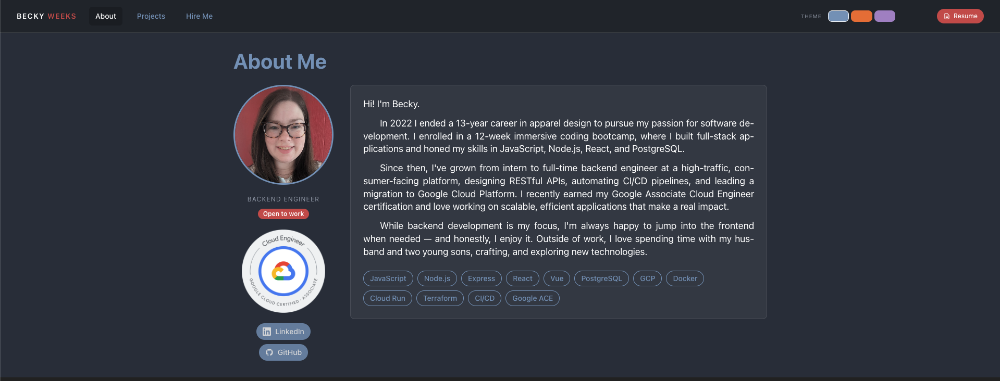

# Becky Weeks — Portfolio

A personal portfolio built to showcase my projects, skills, and background as a backend engineer.



## About

This site is a full-stack application with a React + Vite frontend and a Node.js/Express backend, deployed on Google Cloud Run. It includes:

- **About** — background, skills, and Google ACE certification
- **Projects** — a curated selection of personal and professional projects
- **Hire Me** — services I offer and ways to get in touch

## Tech Stack

**Frontend**
- React + Vite
- Tailwind CSS v4
- Context API for theming (multiple color themes)

**Backend**
- Node.js + Express
- Deployed on Google Cloud Run

## Running Locally

```bash
# Install dependencies
npm install

# Start the dev server
npm run dev
```

The frontend runs on `http://localhost:5173` by default.
